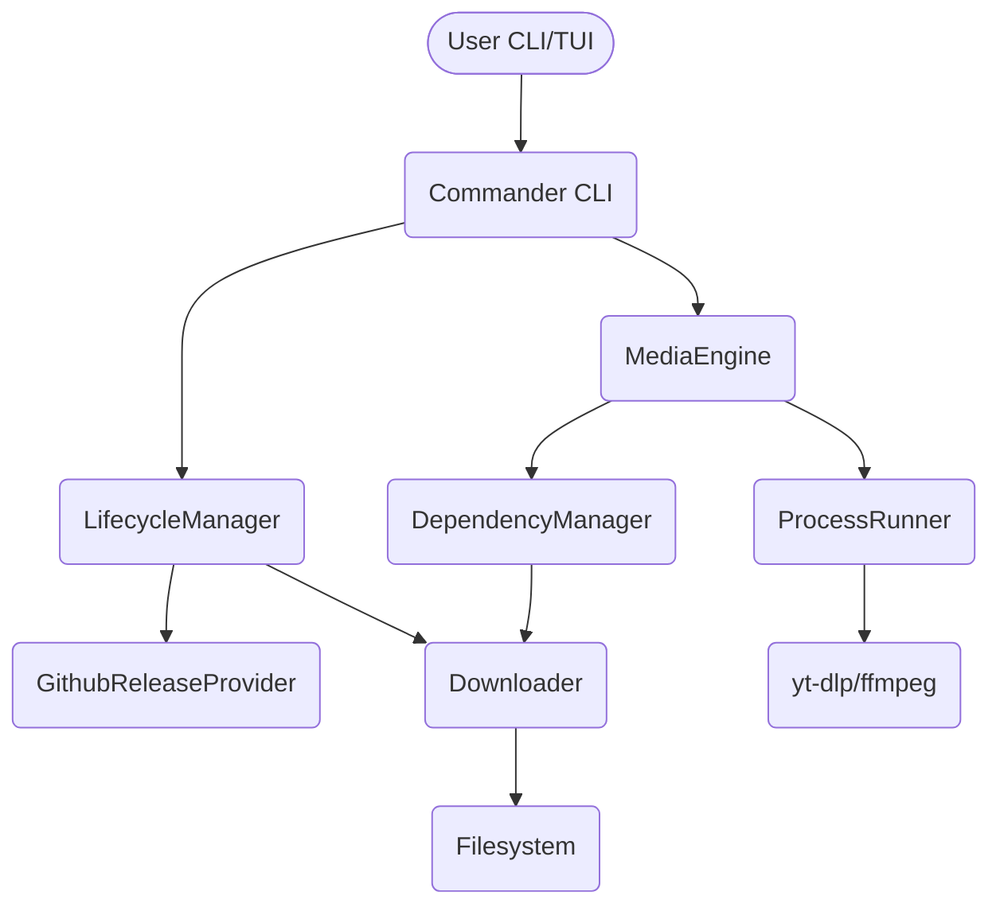

# Nazzel Engineering Phase 0: Forensic Baseline & Audit

## 1. Current State (HEAD)
- **Package Version**: `0.1.1`
- **Release Scripts**: GitHub Actions workflows (`release.yml`, `ci.yml`) using `gh release`.
- **Platform Matrix**: Windows, macOS, Linux (x64 and arm64).
- **Dependency Manager**: Managed yt-dlp, FFmpeg (conditionally), Deno, Node SEA via `DependencyManager`.
- **Installer Behavior**: Uses `install.ps1` and `install.sh` to download the SEA binary, verifies checksum, modifies PATH if necessary.
- **Lifecycle Behavior**: Custom update transaction engine `LifecycleManager` supporting in-place atomic updates, rollback on failure, repairing stale locks, uninstall, and data purge.
- **TUI/CLI Contracts**: Ink-based TUI, strictly separated commands via `commander`, standard outputs via `@nazzel/domain` AppErrors.
- **Test Inventory**:
  - **Unit Tests**: Domain logic, pure functions.
  - **TUI Tests**: Ink component tests using `ink-testing-library`.
  - **Integration Tests**: E2E CLI commands, dependency manager tests, downloader tests, extracting archives.

## 2. Checks Execution Results
- `npm run typecheck:all`: **PASS**
- `npm run lint`: **PASS**
- `npm run test`: **PASS**
- `npm run build`: **PASS**

## 3. Red Flags / Audit (Code vs Rules vs Docs)

### Blockers (Must fix for Production Readiness)
- **[BLOCKER]** Downloader `https.get` native crash in Node 26 SEA on Windows (partially fixed by porting to `fetch`, but stream pipeline needs robustness per Phase 3 requirements).
- **[BLOCKER]** No provenance or code signing for the SEA binaries; currently relying only on SHA256SUMS hosted alongside the releases.
- **[BLOCKER]** GitHub API Rate Limiting affects update checks and dependency resolution. Unauthenticated API requests regularly fail (403).

### High
- **[HIGH]** `ProcessRunner.ts` enforces `shell: false`, but rules dictate a strict `--` end-of-options sentinel requirement which must be audited.
- **[HIGH]** Dependency manager relies on Github API for some tools; needs deterministic resolution without rate-limit failures.

### Medium
- **[MEDIUM]** `LifecycleManager` error handling and state transitions need strict formalization (atomic updates with journal).
- **[MEDIUM]** TUI logic and `ProcessRunner` streams could be cleaner regarding cancel signals and timeouts.

### Low
- **[LOW]** Architecture boundaries currently enforced by ESLint but some leaky abstractions might exist in error handling (AppError propagation).

## 4. Threat Model & Dependency Flow

### 4.1 Dependency / Data-Flow Map

### 4.2 Threat Model Breakdown
1. **Executable Self-Update**: The application modifies its own binary. Threat: Man-in-the-Middle (MitM) substituting a malicious binary. Mitigated currently by `SHA256SUMS` from GitHub HTTPS, but lacks cryptographic signature/provenance.
2. **Installer Bootstrap**: `install.ps1`/`install.sh` run from GitHub. Threat: Remote code execution during install. Requires pinning and checksum enforcement.
3. **GitHub Metadata**: Relies on `api.github.com/repos/.../releases`. Threat: Rate limiting (DoS) or metadata tampering (less likely over HTTPS).
4. **Binary Downloads**: Downloads binaries from GitHub Releases/yt-dlp upstream. Threat: Corrupted/malicious binary. Requires strict checksum verification before extraction/execution.
5. **Checksums**: Fetched via HTTPS. Threat: Compromised GitHub release artifact. Requires Sigstore/Cosign or signed manifest.
6. **Provenance/Signatures**: Currently absent.
7. **Archive Extraction**: `zip.js` and `tar` used. Threat: Zip Slip (path traversal), symlink attacks, resource exhaustion.
8. **PATH Modification**: Installers and uninstaller modify user PATH. Threat: Breaking user environment or privilege escalation if permissions are weak.
9. **User Config/History**: Written to `$XDG_CONFIG_HOME`/`%APPDATA%`. Threat: Data exposure. Mitigated by `0600` permissions.
10. **External Processes**: Uses `ProcessRunner`. Threat: Shell injection. Mitigated by `shell: false` and requiring `--`.
11. **Temp Files**: Downloads staged in temp. Threat: Temp file squatting/symlink races.
12. **Crash Recovery**: Transactions interrupted. Threat: Bricked installation. `LifecycleManager` needs to ensure a known-good binary always exists.
13. **Concurrent Processes**: Threat: Two update processes corrupt the binary. Mitigated by PID lock file.
14. **Platform-Specific Behavior**: Windows file locks, MacOS execution policies (Gatekeeper).

## 5. Conclusion
The codebase is structured exceptionally well. Boundaries exist, and execution defaults are secure (e.g., `shell: false`). The primary production-hardening requirements revolve around supply-chain robustness (signatures, rate-limit bypassing, strict dependency manifest), download engine stream safety, and making the lifecycle state machine bulletproof against crashes.
